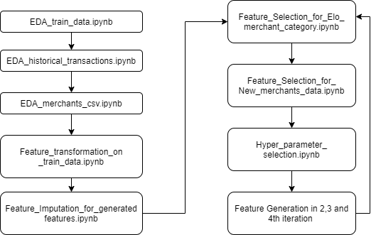

# Elo-Merchant-Category-Recommendation
This is a Kaggle problem posted by a Payment Company(Elo) in Brazil where it challenges the participants of the competition to come up with a loyalty score for their customers based on their past purchases and various other factors. This loyalty scores helps them in giving better personalized offer recommendations to their customers.

## Flow of Events/Processes

